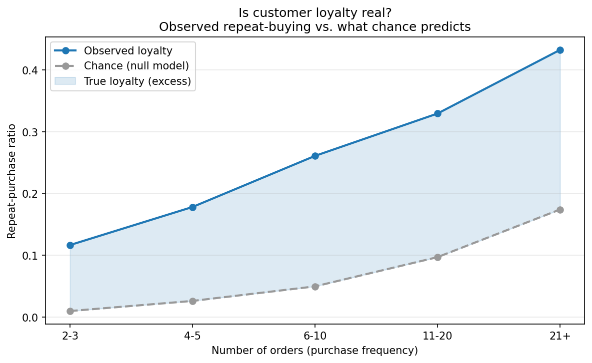
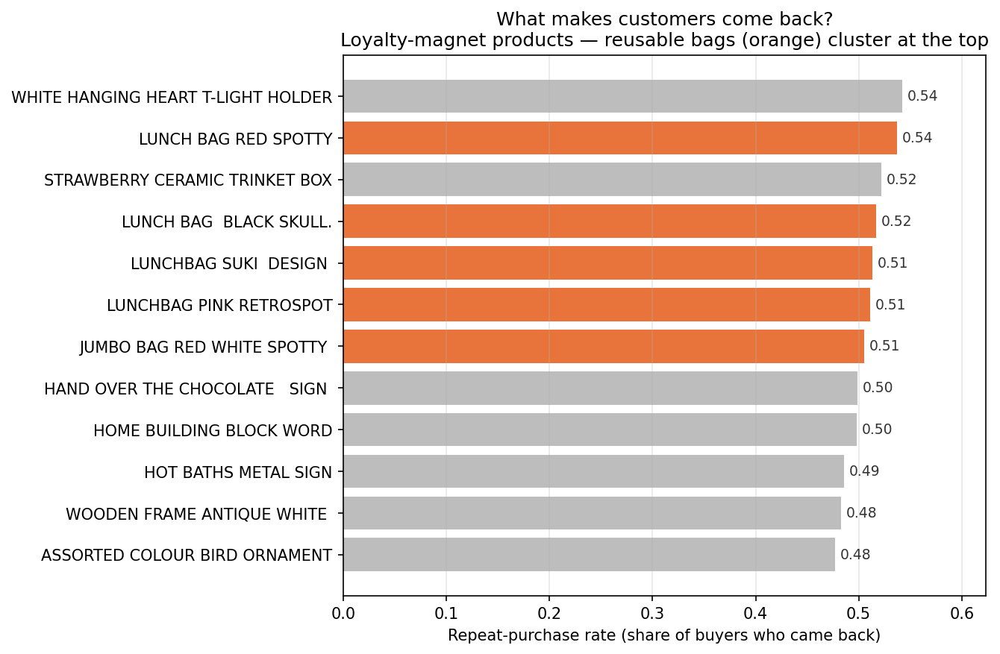

# ロイヤルカスタマーは実在するのか？ / Is Customer Loyalty Real?

**イギリスの雑貨店、100万件の取引から「顧客の忠誠心」を計量経済学で測る**
*A reproducible, econometric test of customer loyalty on 1M+ real retail transactions.*

[](https://colab.research.google.com/github/Sagittarius8083/Sagittarius-Repository/blob/main/260610_01_%E3%82%A4%E3%82%AE%E3%83%AA%E3%82%B9%E3%81%AE%E3%82%AA%E3%83%B3%E3%83%A9%E3%82%A4%E3%83%B3%E3%82%B7%E3%83%A7%E3%83%83%E3%83%94%E3%83%B3%E3%82%B0%E8%B3%BC%E8%B2%B7%E3%83%87%E3%83%BC%E3%82%BF%E5%88%86%E6%9E%90_3.ipynb)


---

## TL;DR

"Loyal customers" は実在するのか、それとも「よく買う人ほど忠誠的に見える」だけの統計の錯覚（ダブル・ジェパディ）なのか。
イギリスのギフト雑貨店の実取引 **1,067,371件** を使い、**ヌルモデル（忠誠心ゼロの架空客）との比較**で検証した。

> **結論：忠誠心は実在する。ただしナイーブな指標が見せるほど例外的ではなく、その一部は購入頻度が生む幻だった。そして最も純粋な再購入は「たまにしか来ない客」の中にあった。**

商業的な含意：**忠誠を生んだのは飾り物ではなく「ランチバッグ」**——使い込み、デザイン違いで集めたくなる実用品だった。

---

## 主要な結果 / Key Findings



| 注文回数 | 観測された忠誠 | 偶然の予測（ヌル） | 真の忠誠（差分） |
|:--|--:|--:|--:|
| 2–3 回 | 0.117 | 0.010 | **0.107** |
| 4–5 回 | 0.178 | 0.026 | **0.152** |
| 6–10 回 | 0.261 | 0.050 | **0.211** |
| 11–20 回 | 0.330 | 0.097 | **0.232** |
| 21 回以上 | 0.433 | 0.174 | **0.258** |

- 典型的なリピーターが再購入する商品は、買った品のうち **約6分の1**（中央値 0.167）。多くの消費者は「一途」ではなく「多情」。
- それでも観測値はヌルを **全頻度帯で大きく上回り**、本物の忠誠の存在を確認。
- 「よく買う人ほど忠誠的」の **一部は機械的な見せかけ**（ヌルも頻度とともに上昇）。
- 業者除去の線（一品200個）を 100〜500 に動かしても結論は不変（中央値 0.156–0.175）。



---

## 手法 / Method

1. **クレンジング** — 顧客ID欠損・返品・異常価格を除去（1,067,371 → 805,549 件）
2. **卸売業者の分離** — k-means で「自然な島はない（連続体）」と確認 → 透明なしきい値（一品最大200個以上＝業者）で分離。消費者 5,416 人を抽出
3. **忠誠度の測定** — 顧客ごとに「再購入した商品の割合（repeat\_ratio）」を算出（リピーター 3,842 人）
4. **因果的検定** — 人気分布からランダムに買う「忠誠心ゼロの架空客」をモンテカルロで生成し、観測値との差（excess）を真の忠誠と定義
5. **ロバストネス** — しきい値感度を確認
6. **磁石商品の特定** — 商品別の再購入率（非商品コードは除外）

---

## 再現方法 / Reproduce

サーバー不要。Google Colab で開いて上から実行するだけ。データは UCI から自動取得されます。

```bash
# ローカルで動かす場合
pip install duckdb pandas numpy scikit-learn matplotlib
```

**Stack:** Python / DuckDB (in-notebook SQL) / scikit-learn / matplotlib

---

## データ / Data

UCI Machine Learning Repository — **Online Retail II**
Chen, D. (2012). *Online Retail II* [Dataset]. UCI Machine Learning Repository. https://doi.org/10.24432/C5CG6D
License: **CC BY 4.0**

---

## 全文レポート / Full Write-up

分析の物語・解釈・限界は、note 記事で読めます：〔note リンク：https://note.com/bright_eagle679/n/nf335a3e9378d?app_launch=false〕
